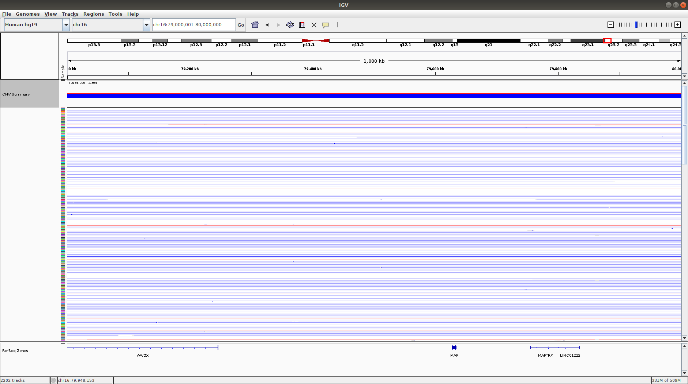
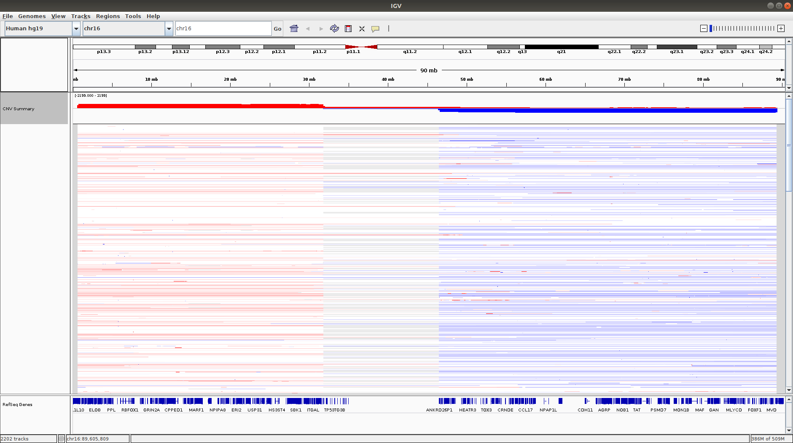
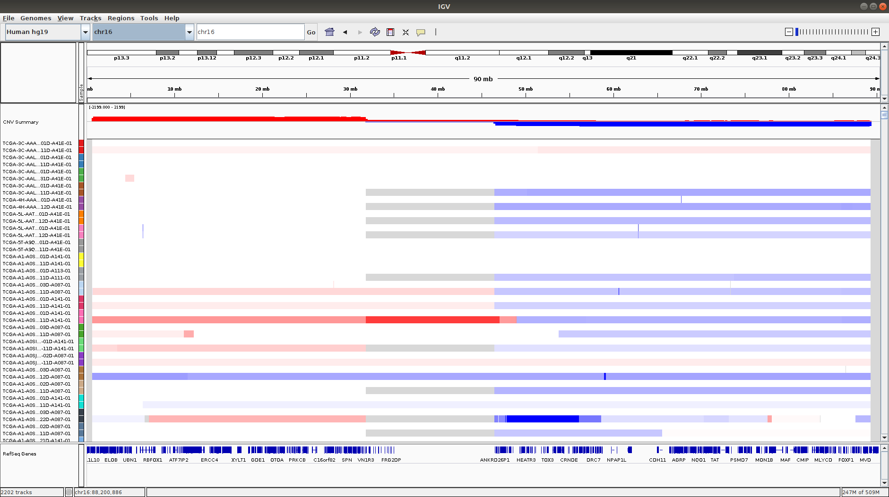
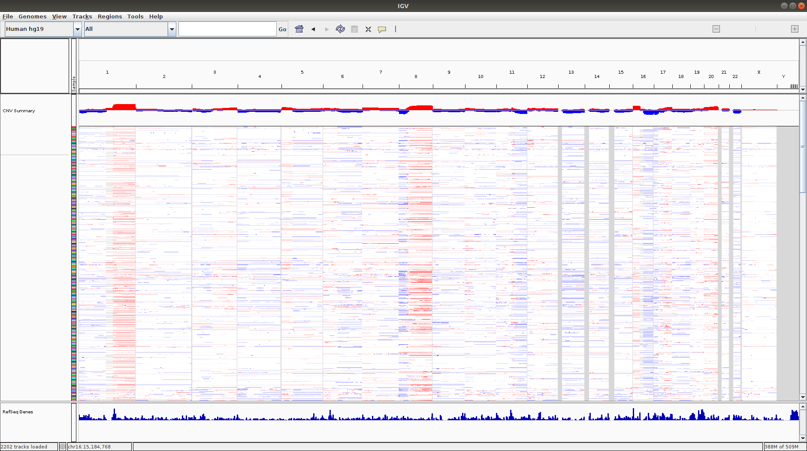

```{r setup, include=FALSE}
knitr::opts_chunk$set(echo = TRUE)
```
## 1: Overlaps between genomic regions and copy number alterations. 
Data: **BRCA.genome_wide_snp_6_broad_Level_3_scna.seg**
TCGA segment data for primary breast cancer patient samples
     
## 2: Frequency of copy number alteration events within genomic regions.
Data: **BRCA.genome_wide_snp_6_broad_Level_3_scna.seg**
     
## 3: Reading and extracting sequencing data 
Data: **BRCA_IDC_cfDNA.bam and BRCA_IDC_cfDNA.bai**
Generated dataset from Sequence Read Archive (SRA) <https://www.ncbi.nlm.nih.gov/sra/?term=SRR2130004> and Gene Expression Omnibus (GEO) <https://www.ncbi.nlm.nih.gov/geo/query/acc.cgi?acc=GSE71378> sequencing data from Illumina HiSeq 2000 platform, paired layout, of cell-free cfDNA libraries ("Cell-free DNA comprises an in vivo, genome-wide nucleosome footprint that informs its tissue(s)-of-origin")
     
## 4: Reading and annotating genomic variants
Data: **GIAB_highconf_v.3.3.2.vcf.gz**
Publicly available dataset of genomic variant calls for the infamous individual, NA12878, a Utah woman, mormon, mother of 11 with a genetic disease, a CYP2D6 mutation. The Genome-in-a-Bottle (GIAB) Consortium has compiled consensus variant calls on this individual's genome. One of the main purposes of this data is to provide a benchmark for those who develop computational tools and analysis of human genomes. <https://github.com/genome-in-a-bottle/giab_latest_release>

# 1: Overlaps between genomic regions and copy number alterations. 

## Preparation
## 1.1 Load copy number segments in *SEG format* from BRCA.genome_wide_snp_6_broad_Level_3_scna.seg. 
SEGment Data (<http://software.broadinstitute.org/software/igv/SEG>) format is tab-delimited and a flexible way to define any genomic data.
The segmentation data file contains TCGA information for primary breast cancer patient samples.

Use `GenomicRanges` library for representation and manipulation of genomic intervals to create a `GRanges` object, which contains among others, an attribute called `seqnames` to represent chromosomes and `ranges` attribute to represent the `start` and `end` coordinates.
```{r, message=FALSE}
library(GenomicRanges)
library(tidyverse)
segs <- read.delim("BRCA.genome_wide_snp_6_broad_Level_3_scna.seg", as.is = TRUE)
head(segs, 5)
mode(segs$Chromosome) <- "character" 
segs[segs$Chromosome == 23, "Chromosome"] <- "X"
# create a GRanges object from segs
segs.gr <- as(segs, "GRanges")
segs.gr
```
## Preparation
## 1.2 SeqInfo for genome build and chromosome naming conventions
Get genome build information - the human genome build, hg19 - directly by installing and loading the`BSgenome.Hsapiens.UCSC.hg19` library
```{r, message=FALSE}
library(BSgenome.Hsapiens.UCSC.hg19)

# load the `SeqInfo` object for human genome hg19
seqinfo2 <- seqinfo(get("BSgenome.Hsapiens.UCSC.hg19")) 

# chromosome naming convention for matching and querying genomic regions. 
# For the human genome reference, there are 2 conventions for hg19:

#  1. UCSC - uses "chr" string in front of the chromosome number (e.g. chr1)
#  2. NCBI - does not add a string to the front of the chromosome number (e.g. 1)

seqlevelsStyle(seqinfo2) <- "NCBI"
seqinfo2

# work with the known autosomes and sex chromosomes in NCBI format, `1:22, "X", "Y"`.
chrs <- c(1:22, "X", "Y") # NCBI format
seqinfo3 <- keepSeqlevels(seqinfo2, value = chrs) #select the autosomes and sex chromosomes
seqinfo3
```

## a. Find the segments in `segs.gr` that have *any* overlap with the region `chr8:128,746,347-128,755,810`
Print out the first five unique TCGA IDs. 
```{r}
seqinfo(segs.gr) <- seqinfo3

#slen <- seqlengths(seqinfo3) # get the length of the chromosomes
tileWidth <- 500000 # tile size of 500kb
#divide the genome into tiles/windows/bins
tiles <- tileGenome(seqlengths = seqlengths(seqinfo3), tilewidth = tileWidth,
                    cut.last.tile.in.chrom = TRUE)
tiles

q <- GRanges(seqnames = "8", ranges = IRanges(start = 128746347, end = 128755810))
tiles.subset <- subsetByOverlaps(x = tiles, ranges = q)
tiles.subset

# find the indices of the elements that overlap between two `GRanges`
hits1 <- findOverlaps(query = tiles.subset, subject = segs.gr, type = "any")
class(hits1)
hits1

# create `DataFrame` object that contains the columns in both `query` and `subject` 
# for overlapping ranges
df7 <- mergeByOverlaps(query = tiles.subset, subject = segs.gr, type = "any")
df7
df7$Sample[1:5]
unique(df7$Sample)[1:5]
```

## b. Find the mean of the `Segment_Mean` values for copy number segments that have *any* overlap with the region chr17:37,842,337-37,886,915.
```{r}
q17 <- GRanges(seqnames = "17", ranges = IRanges(start = 37842337, end = 37886915))
tiles.subset <- subsetByOverlaps(x = tiles, ranges = q17)
tiles.subset

hits17 <- findOverlaps(query = tiles.subset, subject = segs.gr, type = "any")
class(hits17)
hits17

df17 <- mergeByOverlaps(query = tiles.subset, subject = segs.gr, type = "any")
df17

ind.segs.overlap.tile <- subjectHits(hits17)
segs.gr[ind.segs.overlap.tile]
segs.tile.means <- segs.gr[ind.segs.overlap.tile]$Segment_Mean
mean(segs.tile.means)
```

## c. Find the patient sample distribution of copy number for `PIK3CA` (hg19).
Find the counts of samples with deletion (D; `Segment_Mean < -0.3`), neutral (N; `Segment_Mean >= -0.3 & Segment_Mean <= 0.3`), gain (G; `Segment_Mean > 0.3`) segments that have `any` overlap with `PIK3CA` gene coordinates.  
```{r}
q3 <- GRanges(seqnames = "3", ranges = IRanges(start = 178866311, end = 178952497))
tiles.subset <- subsetByOverlaps(x = tiles, ranges = q3)
tiles.subset

hits3 <- findOverlaps(query = tiles.subset, subject = segs.gr, type = "any")
class(hits3)
hits3

df3 <- mergeByOverlaps(query = tiles.subset, subject = segs.gr, type = "any")
df3

D <- df3[df3$Segment_Mean < -0.3, ]
D

N <- df3[df3$Segment_Mean >= -0.3 & df3$Segment_Mean <= 0.3,]
N

G <- df3[df3$Segment_Mean > 0.3, ]
G

cat("Number of patient samples with deletions:", nrow(D), "\n")
cat("Number of patient samples with neutral CN:", nrow(N), "\n")
cat("Number of patient samples with gains:", nrow(G))
```

# 2: Frequency of copy number alteration events within genomic regions.

Use the copy number data stored in `segs.gr`.

## a. Create a genome-wide tile of 1Mb windows for the human genome (`hg19`).
```{r} 
tileWidth <- 1000000 # tile size of 1Mb 
#divide the genome into tiles/windows/bins
tiles <- tileGenome(seqlengths = seqlengths(seqinfo3), tilewidth = tileWidth,
                    cut.last.tile.in.chrom = TRUE)
tiles
```

## b. Find the 1Mb window with the most frequent overlapping deletions.
Find the 1Mb windows with `any` overlap with deletion copy number segments. Assume a deletion segment is defined as a segment in `segs.gr` having `Segment_Mean < -0.3`. 

Return one of the 1Mb window `Granges` entry with the highest frequency (count) of deletion segments.
```{r}
# deletion copy number segments
segs.gr.del <- segs.gr[segs.gr$Segment_Mean < -0.3, ]
segs.gr.del

#how many segments overlap each 1Mb genomic tile
counts <- countOverlaps(query = tiles, subject = segs.gr.del, type = "any")
tiles$counts.overlapAny <- counts
tiles

# genomic tiles with highest overlap frequency (count) with deletion segments
tiles[tiles$counts.overlapAny == max(tiles$counts.overlapAny), ]
```

## c. Visually inspect the deletion overlap result from part (b) using the Integrative Genome Viewer (IGV).
Screen shot of IGV at the 1Mb window with the most frequent overlap with deletion segments. The image includes the segments from `BRCA.genome_wide_snp_6_broad_Level_3_scna.seg` loaded. 









\pagebreak
# 3: Reading and extracting sequencing data 

Binary Alignment/Map Format (BAM) <http://samtools.github.io/hts-specs/SAMv1.pdf> specification

## Preparation
```{r, message=FALSE}
library(Rsamtools)
bamFile <- "BRCA_IDC_cfDNA.bam"
```

## a. Retrieve reads in the BAM file `BRCA_IDC_cfDNA.bam` at `chr12:25,380,269-25,380,308`.
Use the same settings for `scanBamWhat()`, `scanBamFlag()`, and `ScanBamParam()` as in Section `1` of `Lecture16_Rsamtools.Rmd`.

The BAM file is the primary input for Rsamtools. There are two initial steps:

  1. Define the genomic coordinates and components to query (`ScanBamParam`)
  2. Scan the BAM file (`scanBam`)
  
## 1. Setup parameters for scanning BAM file

* Specify the genomic location of interest to query in the BAM file.
* Specify which fields to return in the query.
* Specify the filters to use to include or exclude reads.
* Instantiate parameter object used in scanning the BAM file.
```{r}
# Specify the genomic location of interest to query in the BAM file.
whichRanges <- GRanges(seqnames = "12",
                        IRanges(start = 25380269, end = 25380308))
whichRanges

# Specify which fields to return in the query.
whatFields <- scanBamWhat()
whatFields

# Specify the filters to use to include or exclude reads.
# First, specify the status of the reads based on the `FLAG`
flag <- scanBamFlag(isDuplicate = FALSE)
flag
# Next, specify additional filters to use including `mapqFilter`, `tagFilter`
mapqFilter = 30  # specifies the minimum mapping quality to include
tagFilter = c("RG")  # A character vector naming tags to be extracted. 
#A tag is an optional field, with arbitrary information, stored with each record; RG - Read Group

# Instantiate parameter object influencing what fields and which records 
# are imported from a (binary alignment) BAM file
param <- ScanBamParam(which = whichRanges, what = whatFields,  
             mapqFilter = mapqFilter, tag = tagFilter)
param
```

## 2. Query the BAM file
```{r}
bam <- scanBam(bamFile, param = param)
bam
```
This returns a `list` object with each element representing a read. For each element/read, there is another `list` with the fields in the BAM file requested with `scanBamWhat()`. Below is a breakdown of what is in the first read.

```{r}
bam[[1]]$qname # read query template name
bam[[1]]$flag  # bitwise flag describing the read alignment
bam[[1]]$rname # reference sequence name (i.e chr12 or 12)
bam[[1]]$pos   # position of aligned read (leftmost coordinate)
bam[[1]]$mapq  # mapping quality of the read alignment
bam[[1]]$cigar # CIGAR string: code string to describe read alignment sequence match to reference
bam[[1]]$mrnm  # mate read's reference sequence name
bam[[1]]$mpos  # mate read's aligned position
bam[[1]]$isize # insert size or template length; aka fragment size
as.character(bam[[1]]$seq)   # sequence of mapped reads on forward strand
as.character(bam[[1]]$qual)  # base qualities of the sequence alignment
bam[[1]]$tag   # value for the tag we specified
```
## b. What is the fraction of G+C bases in the mapped read sequence? 
Count the number of G and C bases in the read sequence.
```{r}
#mapped read sequence
dna.seq <- as.character(unlist(bam[[1]]$seq))
dna.seq

# GC fraction
gc.fraction <- sum(unlist(strsplit(dna.seq, split = "")) %in% c("C", "G")) /  nchar(dna.seq)
gc.fraction

# GC fraction - alternative implementation
gc.fraction <- lengths(gregexpr("C|G", dna.seq)) / nchar(dna.seq)
gc.fraction

# GC fraction - alternative implementation using str_count from stringr package
# library(stringr)
gc.fraction <- str_count(dna.seq, "C|G") / nchar(dna.seq)
gc.fraction
```

# 4: Reading and annotating genomic variants

Variant Call Format (VCF) <http://samtools.github.io/hts-specs/VCFv4.2.pdf> specification

## Preparation
```{r, message=FALSE}
library(VariantAnnotation)
vcfFile <- "GIAB_highconf_v.3.3.2.vcf.gz"
```

## a. Load variant data from VCF file `GIAB_highconf_v.3.3.2.vcf.gz` for `chr8:128,700,000-129,000,000`.
Use genome build `hg19`.
```{r}
vcfHead <- scanVcfHeader(vcfFile)
q <- GRanges(seqnames = "8", ranges = IRanges(start = 128700000, end = 129000000))
vcf.param <- ScanVcfParam(which = q) # single 500kb bin
vcf <- readVcf(vcfFile, genome = "hg19", param = vcf.param)
vcf
```
The `vcf` variable is of class `CollapsedVCF` and contains header information and data. The information that has been parsed by `readVcf` is explained below.

The `rowRanges` function returns a `GRanges` object containing the coordinates, REF/ALT bases, quality, and filtering status of the variants.
```{r}
genoRanges <- rowRanges(vcf)
genoRanges
```
The `INFO` column in the original VCF text file contains a semi-colon delimited set of custom fields with flexible format that algorithms will output, here parsed into usable format. 
Fields are available from the header below
```{r}
info(header(vcf)) # returns a DataFrame object
```
The `FORMAT` column in the original VCF text file contains the format and description of the genotype fields.
```{r}
geno(header(vcf))
```

## b. Combine the fields of the VCF genotype information into a table.
```{r}
genoData <- data.frame(geno(vcf)$GT, 
                   geno(vcf)$DP,
                   geno(vcf)$GQ, 
                   geno(vcf)$ADALL,
                   geno(vcf)$AD, 
                   geno(vcf)$IGT,
                   geno(vcf)$IPS, 
                   geno(vcf)$PS
                   )
colnames(genoData) <- rownames(geno(header(vcf)))
head(genoData, n=10)
dim(genoData)
```

## c. Retrieve the following information at chr8:128747953.
Print out the SNP ID (i.e. "rs ID"), reference base (`REF`), alternate base (`ALT`), genotype (`GT`), depth (`DP`), allele depth (`ADALL`), phase set (`PS`).
```{r}
variant <- genoRanges[ranges(genoRanges) == IRanges(start = 128747953, end=128747953)]
variant
snp.id <- names(variant)
ref.base <- as.character(variant$REF)
alt.base <- as.character(unlist(variant$ALT))

genoData[snp.id, ]
genotype <- as.character(genoData[snp.id, ]$GT)
depth <- genoData[snp.id, ]$DP
allele.depth <- unlist(genoData[snp.id, ]$ADALL)
phase.set <- as.character(genoData[snp.id, ]$PS)

cat("SNP ID:", snp.id, "\n")
cat("Reference base:", ref.base, "\n")
cat("Alternate base:", alt.base, "\n")
cat("Genotype:", genotype, "\n")
cat("Read depth:", depth, "\n")
cat("Allele depth:", allele.depth, "\n")
cat("Phase set:", phase.set)
```
```{r}
sessionInfo()
```