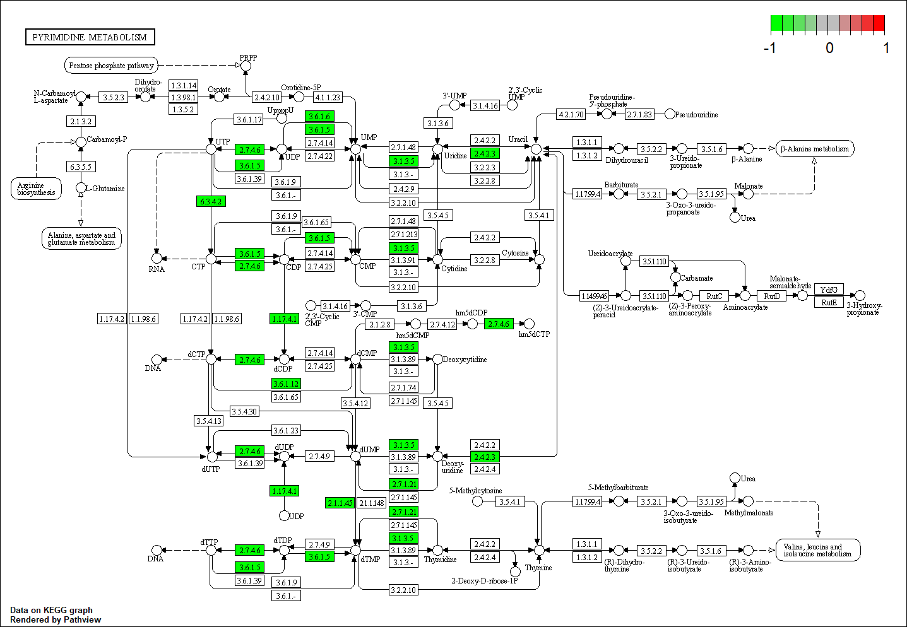

```{r setup, include=FALSE}
knitr::opts_chunk$set(echo = TRUE)
```
## Install the CummeRbund package

Analysis, exploration, manipulation, and visualization of Cufflinks high-throughput sequencing data

```{r, message=FALSE, warning=FALSE}
#if (!require("BiocManager", quietly = TRUE))
#    install.packages("BiocManager")

#BiocManager::install("cummeRbund")
```

## Load the CummeRbund package

```{r, message=FALSE, warning=FALSE}
library(cummeRbund)
```

## Create a CummeRbund database from the Cuffdiff output

```{r}
print(readCufflinks)
```

```{r}
cuff_data <- readCufflinks(dir = '../cuffdiff2/diff_out/')
cuff_data@genes # or genes(cuff_data)
getLevels(cuff_data)
replicates(cuff_data)
cuff_data
```
## Plot the distribution of expression levels for all genes for each sample/condition

C1 - untreated 
C2 - treated

`csDensity` method creates a smoothed density plot, by sample, for log10 FPKM values from a cuffdiff run
FPKM - fragments per kilobase of transcript per million fragments mapped

```{r}
csDensity(genes(cuff_data), pseudocount=1.0)
```

## Compare the expression of each gene in the two conditions 

`csScatter` method creates a scatter plot comparing the FPKM values from the two samples in a cuffdiff run

```{r, message=FALSE, warnings=FALSE}
csScatter(cuff_data@genes, 'C1', 'C2', pseudocount=1.0, colorByStatus=T, smooth=T)
```

## Inspect differentially expressed genes 

`csVolcano` method creates a volcano plot of log fold change in expression vs significance (-log(pval)) for the two samples in a cuffdiff run

```{r}
gene_diff_data <- diffData(genes(cuff_data), 'C1', 'C2')
head(gene_diff_data)

sig_gene_data <- subset(gene_diff_data, (significant == 'yes'))
nrow(sig_gene_data)

csVolcano(cuff_data@genes, 'C1', 'C2', alpha=0.05, showSignificant=T)
```

## Explore expression levels for some gene 

```{r, message=FALSE, warning=FALSE}
mygene <- getGene(cuff_data, 'SNRNP27')
expressionBarplot(mygene)
```

## Look at the `gene_exp.diff` and `iso_exp.diff` files generated by cuffdiff

```{r}
gene_expr_diff <- read.delim2('../cuffdiff2/diff_out/gene_exp.diff')
head(gene_expr_diff)
iso_expr_diff <- read.delim2('../cuffdiff2/diff_out/isoform_exp.diff')
head(gene_expr_diff[gene_expr_diff$status == 'OK' & gene_expr_diff$significant == 'yes', ])
nrow(gene_expr_diff[gene_expr_diff$status == 'OK' & gene_expr_diff$significant == 'yes', ])
head(iso_expr_diff[iso_expr_diff$status == 'OK' & iso_expr_diff$significant == 'yes', ])
nrow(iso_expr_diff[iso_expr_diff$status == 'OK' & iso_expr_diff$significant == 'yes', ])
```

## Volcano Plot

```{r}

ged <- gene_expr_diff[gene_expr_diff$status == 'OK' & !is.infinite(as.numeric(gene_expr_diff$log2.fold_change.)), ]
ged$log2.fold.change <- as.numeric(ged$log2.fold_change.)
ged$adj.p.value <- as.numeric(ged$q_value)
head(ged)

h.line <- -log10(0.05) 
v.line <- log2(2) 

ged$diff.expr <- "No"
ged$diff.expr[ged$log2.fold.change > v.line & -log10(ged$adj.p.value) > h.line ] <- "Up"
ged$diff.expr[ged$log2.fold.change < -v.line & -log10(ged$adj.p.value) > h.line ] <- "Down"

head(ged)
```

```{r}
cols <- c("green", "red", "black")
names(cols) <- c("Down", "Up", "No")

vp <- ggplot(data=ged, aes(x=log2.fold.change, y=-log10(adj.p.value ), col=diff.expr)) + 
  geom_point() + theme_minimal() +
  scale_color_manual(values=cols) +
  geom_vline(xintercept=c(-v.line, v.line), col="red") + 
  geom_hline(yintercept=h.line, col="red") 
  

vp
```

## Top 10 down- and up-regulated genes

```{r}
ged.diff.expr <- ged[ged$diff.expr %in% c("Up", "Down"),]
dim(ged.diff.expr)
dim(ged.diff.expr[ged.diff.expr$significant == "no",])
ged.diff.expr.order <- ged.diff.expr[order(ged.diff.expr[, 15]),] 
head(ged.diff.expr.order, n=5)
tail(ged.diff.expr.order, n=5)
```

## Expression Bar Plot

PFKFB4 - here, downregulated under treatment
PFKFB4 is a therapeutic target for multiple myeloma

The expression plot illustrates the differences in the expression of *PFKFB4* across conditions C1 (untreated) and C2 (treated).
Expression of a transcript is proportional to the number of reads sequenced from that transcript after normalizing for that transcript's length.
Error bars, annotating each gene and transcript expression value capture cross-replicate variability and measurement uncertainty as estimated by cuffdiff's statistical model of RNA-seq.

```{r, message=FALSE, warning=FALSE}
mygene <- getGene(cuff_data, 'PFKFB4')
expressionBarplot(mygene, replicates=T)
```
Expression bar plot of individual isoform expression levels of *PFKFB4*

Changes in *PFKFB4* expression attributable to a large increase in one of four alternative isoforms 

```{r, message=FALSE, warning=FALSE}
mygene <- getGene(cuff_data, 'PFKFB4')
expressionBarplot(isoforms(mygene), replicates=T)
```

## Pie chart showing the relative proportion of individual isoforms for the *PFKFB4* gene across conditions

```{r, message=FALSE, warning=FALSE}
csPie(mygene,level="isoforms")
```

```{r, message=FALSE, warning=FALSE}
mygene <- getGene(cuff_data, 'PFKFB4')
mygene
mygene@count
mygene@fpkm
```
MGAM - here, upregulated under treatment

```{r, message=FALSE, warning=FALSE}
mygene <- getGene(cuff_data, 'XLOC_031652') #MGAM
mygene
mygene@count
mygene@isoforms
expressionPlot(mygene,replicates=T)
expressionBarplot(isoforms(mygene), replicates=T)
```
## Differential Expression

```{r, message=FALSE, warning=FALSE}
gene_diff_data <- diffData(genes(cuff_data), 'C1', 'C2')
sig_gene_data <- subset(gene_diff_data, (significant == 'yes'))
nrow(sig_gene_data)

isoforms_diff_data <- diffData(cuff_data@isoforms, 'C1', 'C2')
sig_isoform_data <- subset(isoforms_diff_data, (significant == 'yes'))
nrow(sig_isoform_data)

tss_diff_data <- diffData(cuff_data@TSS, 'C1', 'C2')
sig_tss_data <- subset(tss_diff_data, (significant == 'yes'))
nrow(sig_tss_data)

cds_diff_data <- diffData(cuff_data@CDS, 'C1', 'C2')
sig_cds_data <- subset(cds_diff_data, (significant == 'yes'))
nrow(sig_cds_data)
```
```{r, message=FALSE, warning=FALSE}
library("gridExtra")
grid.arrange(sigMatrix(cuff_data,level='genes',alpha=0.05), 
             sigMatrix(cuff_data,level='isoforms',alpha=0.05),
             sigMatrix(cuff_data,level='TSS',alpha=0.05), 
             sigMatrix(cuff_data,level='CDS',alpha=0.05), 
             ncol = 2, nrow = 2)
```
or

```{r, message=FALSE, warning=FALSE}
#install.packages("ggpubr")
library(ggpubr)
ggarrange(sigMatrix(cuff_data,level='genes',alpha=0.05), 
          sigMatrix(cuff_data,level='isoforms',alpha=0.05),
          sigMatrix(cuff_data,level='TSS',alpha=0.05), 
          sigMatrix(cuff_data,level='CDS',alpha=0.05), 
          ncol = 2, nrow = 2)
```

```{r, message=FALSE, warning=FALSE}
promoter_diff_data <- distValues(cuff_data@promoters, 'C1', 'C2')
sig_promoter_data <- subset(promoter_diff_data, (significant == 'yes'))
nrow(sig_promoter_data)

splicing_diff_data <- distValues(cuff_data@splicing, 'C1', 'C2')
sig_splicing_data <- subset(splicing_diff_data, (significant == 'yes'))
nrow(sig_splicing_data)

relCDS_diff_data <- distValues(cuff_data@relCDS, 'C1', 'C2')
sig_relCDS_data <- subset(relCDS_diff_data, (significant == 'yes'))
nrow(sig_relCDS_data)
```
## Data Exploration

## Distance matrix

Visualize pairwise similarities between conditions
```{r}
csDistHeat(cuff_data@genes,replicates=T,pseudocount=1.0)
```
### Dimensionality Reduction

```{r, message=FALSE, warning=FALSE, fig.height=6, fig.width=6}
ggarrange(PCAplot(cuff_data@genes,'PC1','PC2',replicates=T),
          MDSplot(cuff_data@genes, replicates=T),
          labels=c('PCA', 'MDS'),
          label.x=0.4, label.y=0.95,
          ncol = 1, nrow = 2,
          align='v')
```

Look at the data passed to the PCAplot and the actual values plotted

```{r, message=FALSE, warning=FALSE}
genes.PCA <- PCAplot(cuff_data@genes,'PC1','PC2')
# actual data passsed to PCAplot
head(ggplot_build(genes.PCA)$plot$data)
#or
#library(purrr)
#genes.PCA %>% pluck("data")

# values plotted
head(layer_data(genes.PCA, 1))
```

## K-means clustering

Identify clusters of genes with similar expression profiles learned from data during partitioning
Plot log-transformed FPKM values over conditions faceted by k-means clustering clusters

```{r, message=FALSE, warning=FALSE}
# cluster first 400 highly significant genes
sig.genes.ids <- getSig(cuff_data,alpha=0.0002,level='genes')[0:400]
sig.genes <- getGenes(cuff_data, sig.genes.ids)
ic<-csCluster(sig.genes,k=4)
head(ic)
icp <- csClusterPlot(ic)
icp
```

```{r, message=FALSE, warning=FALSE}

icp.data <- ggplot_build(icp)$plot$data
head(icp.data)
tail(icp.data)

# values plotted
head(layer_data(icp, 1))
```
## Specificity

Identify genes that are condition specific
Produce an ordered list of genes based on their specificity for a given condition
```{r}
# install.packages('printr')
library(printr)
help(csSpecificity)
```

```{r, message=FALSE, warning=FALSE}
sig.genes.ids <- getSig(cuff_data,alpha=0.05,level='genes')
sig.genes.spec <- getGenes(cuff_data, sig.genes.ids)
sig.genes.cspec <- csSpecificity(sig.genes.spec)
head(sig.genes.cspec)

# exclusively expressed in treated condition (C2)
c2.spec <- sig.genes.cspec[which(sig.genes.cspec[, 'C2_spec'] == 1.0),]
nrow(c2.spec)
c2.spec

# exclusively expressed in untreated condition (C1)
c1.spec <- sig.genes.cspec[which(sig.genes.cspec[, 'C1_spec'] == 1.0),]
nrow(c1.spec)
c1.spec
```
## Heatmap of FPKM expression values

```{r, message=FALSE, warning=FALSE}
sig.genes.cs.hm <- csSpecificity(sig.genes)
#sig.genes.cs.hm
c2.spec.hm <- sig.genes.cs.hm[which(sig.genes.cs.hm[, 'C2_spec'] >= 0.7),]
nrow(c2.spec.hm)

c1.spec.hm <- sig.genes.cs.hm[which(sig.genes.cs.hm[, 'C1_spec'] >= 0.7),]
nrow(c1.spec.hm)

gene.spec.hm <- getGenes(cuff_data, c(rownames(c1.spec.hm), rownames(c2.spec.hm)))
gene.spec.hm
csHeatmap(gene.spec.hm,cluster='both',labRow=T, fullnames=T, replicates=T)
```

## Generate matrix of normalized counts

```{r, message=FALSE, warning=FALSE}
gene.count.matrix<-countMatrix(cuff_data@genes)
head(gene.count.matrix)
```

## Generate matrix of FPKM values

```{r, message=FALSE, warning=FALSE}
gene.fpkm.matrix<-fpkmMatrix(cuff_data@genes)
head(gene.fpkm.matrix)
```

## Generate matrix of replicate FPKM values

```{r, message=FALSE, warning=FALSE}
gene.repl.fpkm.matrix<-repFpkmMatrix(cuff_data@genes)
head(gene.repl.fpkm.matrix)
```

## Pathway and Gene-set Analysis

```{r, message=FALSE, warning=FALSE}
#BiocManager::install(c("pathview", "gage", "gageData"))
```

```{r, message=FALSE, warning=FALSE}
# starting from ged.diff.expr.order above
dim(ged.diff.expr.order)
head(ged.diff.expr.order)
cuff.fold.change <- ged.diff.expr.order$log2.fold.change
#cuff.fold.change
head(cuff.fold.change)
tail(cuff.fold.change)

gene.names <- ged.diff.expr.order$gene[ged.diff.expr.order$gene!="-"]
gene.names[0:10]

gene.ids <- ged.diff.expr.order$gene_id
gene.ids[0:10]
```

```{r, message=FALSE, warning=FALSE}
library(pathview)
gene.names.eg <- pathview::id2eg(gene.names, category ="symbol")
head(gene.names.eg, n=10)
gene.names.eg.filter <- gene.names.eg[,2]>"" & !is.na(gene.names.eg[,2])

cuff.fold.change.sel <- cuff.fold.change[gene.names.eg.filter]

names(cuff.fold.change.sel) <- gene.names.eg[gene.names.eg.filter,2]
head(cuff.fold.change.sel)
range(cuff.fold.change.sel)
```

## Pathway Analysis with GAGE (Generally Applicable Gene-set Enrichment for Pathway Analysis)

Infer gene sets that are significantly perturbed (expression-wise) in KEGG pathways

```{r, message=FALSE, warning=FALSE}
library(gage)
data("kegg.gs")
# can do Reactome as well later
# data("reactome.gs")

expr.fc <- cuff.fold.change.sel
fc.kegg.path <- gage(expr.fc, gsets = kegg.gs, ref = NULL, samp = NULL) 
head(fc.kegg.path$greater)
head(fc.kegg.path$less)
head(fc.kegg.path$stats)

# up-regulated pathways
#sel.g <- fc.kegg.path$greater[, "q.val"] < 0.05 & !is.na(fc.kegg.path$greater[, "q.val"])

# down-regulated pathways
sel.l <- fc.kegg.path$less[, "q.val"] < 0.05 & !is.na(fc.kegg.path$less[, "q.val"])
path.ids.l <- rownames(fc.kegg.path$less)[sel.l]
path.ids.l
path.ids <- substr(c(path.ids.l), 1, 8)
```

## Visualization of first 3 pathways with Pathview

```{r, message=FALSE, warning=FALSE}
#library(pathview)
path.view.out.list <- sapply(path.ids[1:3], function(pid) pathview(gene.data = expr.fc, pathway.id = pid,
                                                                   species = "hsa", out.suffix='cufflinks2'))
```

### hsa00240 Pyrimidine metabolism



### hsa04360 Axon guidance


### hsa04142 Lysosome


## Gene-set Enrichment Analysis

Perform GSEA with `gseDO` in the `DOSE` package
DO - disease ontology

```{r, message=FALSE, warning=FALSE}
#BiocManager::install(c("DOSE", "enrichplot"))
```

```{r, message=FALSE, warning=FALSE}
library(DOSE)

expr.fc.desc.order <- expr.fc[order(expr.fc, decreasing = T)]

edo <- gseDO(expr.fc.desc.order)
edo
```

## Gene-set Enrichment Analysis

Visualize the distribution of the gene set and the enrichment score with `enrichplot` package

```{r, message=FALSE, warning=FALSE}
library(enrichplot)

ggarrange(gseaplot2(edo, geneSetID = 1, title = edo$Description[1]),
          gseaplot2(edo, geneSetID = 2, title = edo$Description[2]),
          gseaplot2(edo, geneSetID = 3, title = edo$Description[3]),
          gseaplot2(edo, geneSetID = 4, title = edo$Description[4]),
          ncol = 2, nrow = 2)
```

## Gene-set Enrichment Analysis

Network plot of enriched terms (linkages of genes and biological concepts)

```{r, message=FALSE, warning=FALSE}
#convert gene ID to symbol
edox <- setReadable(edo, 'org.Hs.eg.db', 'ENTREZID')
edox
cnetplot(edox, categorySize="pvalue", foldChange=expr.fc.desc.order, showCategory = 4)
cnetplot(edox, foldChange=expr.fc.desc.order, circular = TRUE, colorEdge = TRUE, showCategory = 4) 
cnetplot(edox, foldChange=expr.fc.desc.order, circular = TRUE, colorEdge = TRUE, showCategory = 1)
cnetplot(edox, foldChange=expr.fc.desc.order, circular = TRUE, colorEdge = TRUE, showCategory = 'cell type cancer') 
```

## PUBMED publications trend of enriched terms

```{r message=FALSE, warning=FALSE}
library(europepmc)
terms <- edox$Description[1:4]
pmcplot(terms, 2010:2020, proportion=FALSE)
```

## GO enrichment analysis

GO ontologies: molecular function (MF), biological process (BP), and cellular component (CC).

```{r, message=FALSE, warning=FALSE}
#BiocManager::install("clusterProfiler")
```

```{r, message=FALSE, warning=FALSE}
library(clusterProfiler)

egogo.cc <- gseGO(geneList = expr.fc.desc.order, OrgDb = org.Hs.eg.db, ont = "CC",
               minGSSize = 100, maxGSSize = 500,
               eps = 0, pvalueCutoff = 0.05,
               verbose = FALSE)

egogo.cc

goplot(egogo.cc)
```


```{r, message=FALSE, warning=FALSE}
egogo.mf <- gseGO(geneList = expr.fc.desc.order, OrgDb = org.Hs.eg.db, ont = "MF",
               minGSSize = 100, maxGSSize = 500,
               eps = 0, pvalueCutoff = 0.05,
               verbose = FALSE)

egogo.mf

goplot(egogo.mf)
```
```{r, message=FALSE, warning=FALSE}
egogo.bp <- gseGO(geneList = expr.fc.desc.order, OrgDb = org.Hs.eg.db, ont = "BP",
               minGSSize = 100, maxGSSize = 500,
               eps = 0, pvalueCutoff = 0.05,
               verbose = FALSE)

egogo.bp

goplot(egogo.bp)
```

```{r}
sessionInfo()
```
