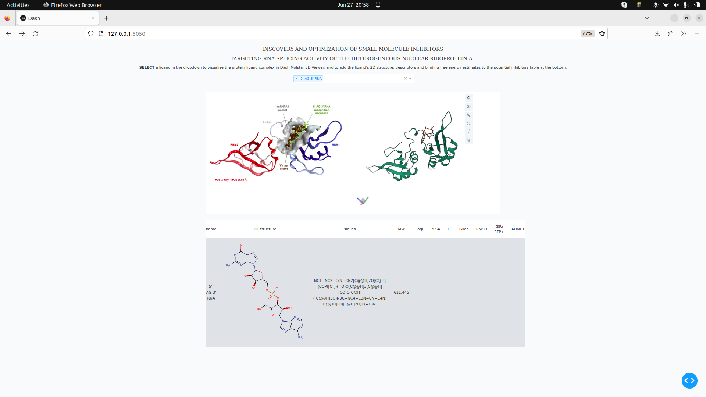
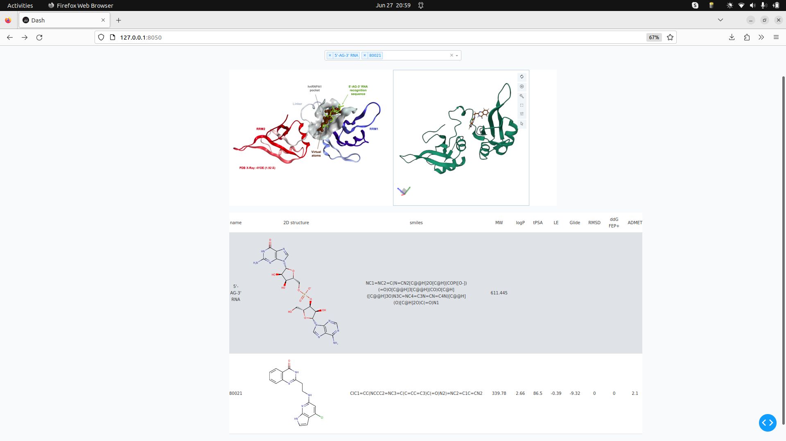
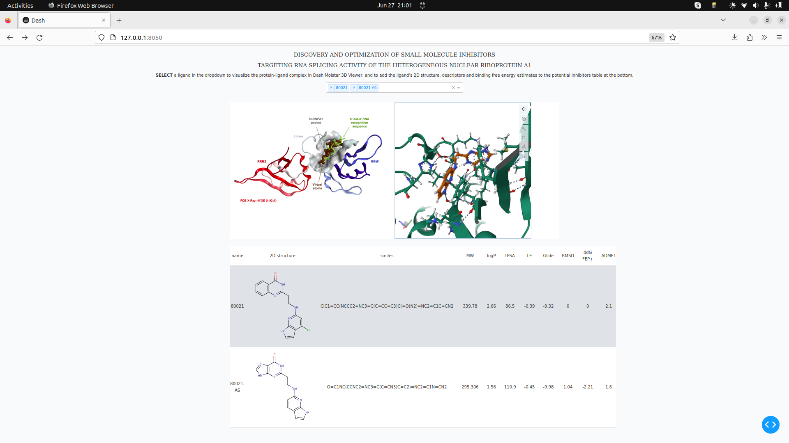
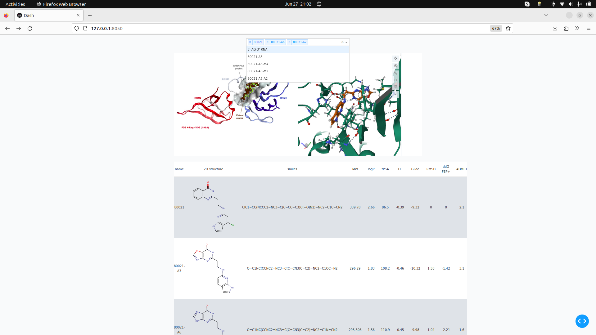
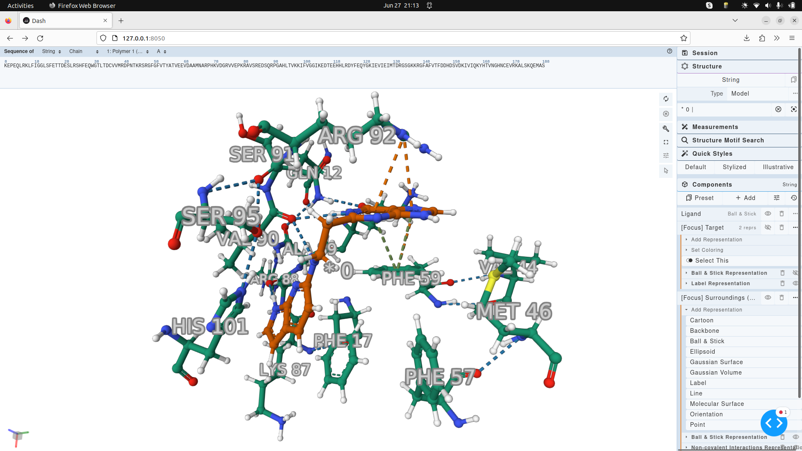

# Web-enabled Computational Drug Discovery with Dash and Molstar

## About the app

A Dash app that enables visualization on the web of my computational drug discovery reasearch and development work to identify and optimize small molecule inhibitors of the hnRNPA1 splicing factor, an RNA-binding protein with critical role in alterbative splicing regulation in cancer. The potential inhibitors target the RNA binding domain of the protein, mimick the interactions that the native diribonuclotide 5'-AG-3' would otherwise make with the protein to compete and disrupt protein-RNA interactions and alter aberrant alternative splicing of hnRNPA1 in treatment-resistant prostate cancer.

## Screenshots

